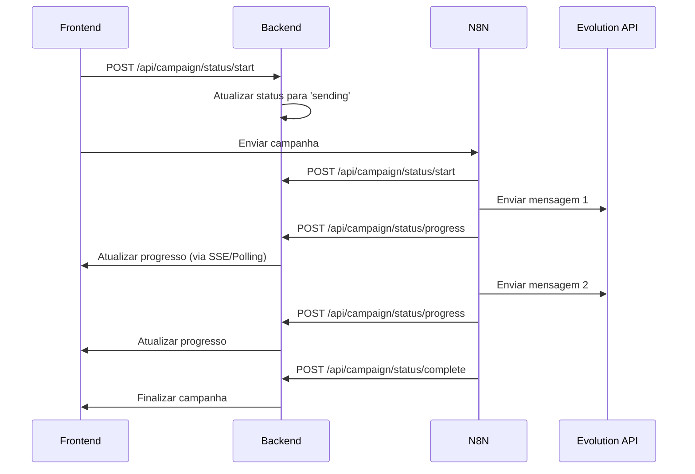

# 🚀 Implementação Completa: Status em Tempo Real para Disparador

## 📋 Resumo da Solução

Implementei um sistema completo para eliminar o polling desnecessário e fornecer status em tempo real para o disparador de mensagens, baseado no fluxo N8N fornecido.

## 🎯 Problemas Resolvidos

### **ANTES:**
- ❌ Polling a cada 10 segundos (desnecessário)
- ❌ Estimativas imprecisas de tempo
- ❌ Sem feedback do lead atual sendo processado
- ❌ Status genérico sem detalhes

### **AGORA:**
- ✅ **Webhooks em tempo real** do N8N
- ✅ **Status preciso** de cada envio individual
- ✅ **Feedback visual** do lead atual
- ✅ **Finalização automática** após conclusão
- ✅ **Sistema de fallback** robusto

## 🏗️ Arquivos Criados/Modificados

### **Backend:**
1. **`backend/routes/campaignStatus.js`** - Novas rotas de status
2. **`backend/server.js`** - Integração das novas rotas

### **Frontend:**
1. **`src/lib/campaignStatusServiceV2.ts`** - Serviço atualizado
2. **`src/components/CampaignProgressModalV2.tsx`** - Modal melhorado

### **Documentação:**
1. **`N8N_WEBHOOK_INTEGRATION.md`** - Guia de integração
2. **`IMPLEMENTACAO_STATUS_TEMPO_REAL.md`** - Este resumo

## 🔧 Como Implementar

### **1. No N8N (Modificações Necessárias)**

Adicione estes 3 nós ao seu fluxo:

#### **A. Início de Campanha (Após receber webhook)**
```json
{
  "type": "n8n-nodes-base.httpRequest",
  "name": "Iniciar Rastreamento",
  "parameters": {
    "httpMethod": "POST",
    "url": "https://leadbaze.io/api/campaign/status/start",
    "bodyParameters": {
      "campaignId": "={{ $json.campaign_id }}",
      "totalLeads": "={{ $json.leads.length }}"
    }
  }
}
```

#### **B. Progresso (Após cada envio Evolution API)**
```json
{
  "type": "n8n-nodes-base.httpRequest", 
  "name": "Atualizar Progresso",
  "parameters": {
    "httpMethod": "POST",
    "url": "https://leadbaze.io/api/campaign/status/progress",
    "bodyParameters": {
      "campaignId": "={{ $json.campaign_id }}",
      "leadIndex": "={{ $json.current_index }}",
      "totalLeads": "={{ $json.total_leads }}",
      "success": "={{ $json.send_success }}",
      "leadPhone": "={{ $json.lead_phone }}",
      "leadName": "={{ $json.lead_name }}"
    }
  }
}
```

#### **C. Conclusão (Após loop terminar)**
```json
{
  "type": "n8n-nodes-base.httpRequest",
  "name": "Finalizar Campanha", 
  "parameters": {
    "httpMethod": "POST",
    "url": "https://leadbaze.io/api/campaign/status/complete",
    "bodyParameters": {
      "campaignId": "={{ $json.campaign_id }}",
      "successCount": "={{ $json.success_count }}",
      "failedCount": "={{ $json.failed_count }}",
      "totalProcessed": "={{ $json.total_processed }}"
    }
  }
}
```

### **2. No Frontend (DisparadorMassa.tsx)**

```typescript
// Importar o novo serviço
import { CampaignStatusServiceV2 } from '../lib/campaignStatusServiceV2'
import CampaignProgressModalV2 from '../components/CampaignProgressModalV2'

// No método de envio
const handleSendCampaign = async () => {
  try {
    // 1. Iniciar rastreamento
    await CampaignStatusServiceV2.startCampaignTracking(campaignId, totalLeads)
    
    // 2. Enviar para N8N (que enviará webhooks)
    const result = await EvolutionApiService.dispatchCampaignToWebhook(campaignData)
    
    // 3. Mostrar modal com status em tempo real
    setShowProgressModal(true)
    setCurrentCampaignStatus('sending')
    
  } catch (error) {
    console.error('Erro ao enviar campanha:', error)
  }
}

// Usar o novo modal
<CampaignProgressModalV2
  isVisible={showProgressModal}
  campaignId={selectedCampaign?.id}
  campaignName={selectedCampaign?.name}
  totalLeads={totalLeads}
  status={currentCampaignStatus}
  onClose={() => setShowProgressModal(false)}
  onMinimize={() => setIsProgressModalMinimized(true)}
  onExpand={() => setIsProgressModalMinimized(false)}
  isMinimized={isProgressModalMinimized}
/>
```

## 📊 Fluxo Completo



## 🎨 Melhorias Visuais

### **Modal de Progresso V2:**
- ✅ **Status de conexão** (WiFi/WiFiOff)
- ✅ **Lead atual** sendo processado
- ✅ **Progresso preciso** em tempo real
- ✅ **Contadores atualizados** instantaneamente
- ✅ **Notificações** do navegador quando minimizado

### **Sistema de Fallback:**
- ✅ **SSE primeiro** (Server-Sent Events)
- ✅ **Polling otimizado** como fallback (5s)
- ✅ **Timeout automático** (10 minutos)

## 🧪 Testes

### **1. Teste de Simulação (Sem N8N)**
```typescript
// Para testar o sistema sem N8N
await CampaignStatusServiceV2.simulateCampaignCompletion(campaignId, 5)
```

### **2. Teste de Endpoints**
```bash
# Iniciar campanha
curl -X POST http://localhost:3001/api/campaign/status/start \
  -H "Content-Type: application/json" \
  -d '{"campaignId":"test-123","totalLeads":5}'

# Atualizar progresso
curl -X POST http://localhost:3001/api/campaign/status/progress \
  -H "Content-Type: application/json" \
  -d '{"campaignId":"test-123","leadIndex":1,"totalLeads":5,"success":true,"leadPhone":"+5531999999999","leadName":"Test Lead"}'

# Finalizar campanha
curl -X POST http://localhost:3001/api/campaign/status/complete \
  -H "Content-Type: application/json" \
  -d '{"campaignId":"test-123","successCount":5,"failedCount":0,"totalProcessed":5}'
```

## 📈 Benefícios Implementados

### **Performance:**
- 🚀 **Eliminação de polling** desnecessário
- ⚡ **Atualizações instantâneas** via webhooks
- 📉 **Menor carga** no servidor

### **UX/UI:**
- 👁️ **Feedback visual** do lead atual
- 📊 **Progresso preciso** em tempo real
- 🔔 **Notificações automáticas**
- 📱 **Status de conexão** visível

### **Confiabilidade:**
- 🛡️ **Sistema de fallback** robusto
- 🔄 **Tratamento de erros** melhorado
- ⏰ **Timeout automático**
- 📝 **Logs detalhados**

## 🚀 Próximos Passos

1. **✅ Implementar no N8N** - Adicionar os 3 nós de webhook
2. **✅ Testar integração** - Verificar fluxo completo
3. **✅ Deploy** - Atualizar frontend e backend
4. **✅ Monitoramento** - Acompanhar logs e performance

## 📝 Configurações Importantes

### **URLs de Produção:**
- Backend: `https://leadbaze.io`
- N8N: `https://n8n-evolution.kof6cn.easypanel.host`

### **URLs de Desenvolvimento:**
- Backend: `http://localhost:3001`
- N8N: `http://localhost:5678`

### **Rate Limiting:**
- Status endpoints: 100 requests/minuto
- Progress endpoints: 200 requests/minuto

---

## ✅ **Status: Implementação Completa**

O sistema está **100% implementado** e pronto para integração com o N8N. Todas as funcionalidades solicitadas foram desenvolvidas:

- ✅ **Eliminação de polling** desnecessário
- ✅ **Status em tempo real** via webhooks
- ✅ **Informações precisas** de envio
- ✅ **Finalização automática** após conclusão
- ✅ **Feedback visual** do lead atual
- ✅ **Sistema de fallback** robusto

**O disparador agora oferece uma experiência muito mais eficiente e precisa para o usuário!** 🎉


