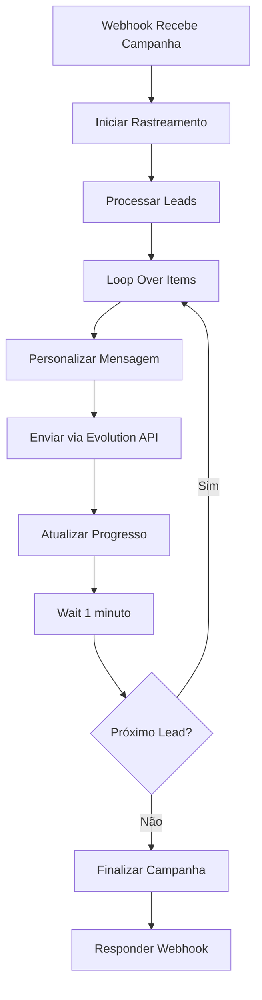

# 🔗 Integração de Webhooks N8N - Sistema de Status em Tempo Real

## 📋 Visão Geral

Este documento explica como integrar o fluxo N8N com o sistema de status em tempo real do LeadFlow, eliminando a necessidade de polling e fornecendo atualizações instantâneas do progresso das campanhas.

## 🎯 Objetivos

- ✅ **Eliminar polling desnecessário**
- ✅ **Status em tempo real via webhooks**
- ✅ **Informações precisas de envio**
- ✅ **Finalização automática após conclusão**
- ✅ **Feedback visual do lead atual sendo processado**

## 🏗️ Arquitetura da Solução

### **Fluxo Atual vs Novo Fluxo**

#### **ANTES (Com Polling):**
```
Frontend → Polling a cada 10s → Backend → Supabase
```

#### **AGORA (Com Webhooks):**
```
N8N → Webhook → Backend → Supabase → Frontend (via SSE/Polling)
```

## 🔧 Implementação no N8N

### **1. Modificações Necessárias no Fluxo N8N**

Adicione os seguintes nós ao seu fluxo N8N:

#### **A. Nó de Início de Campanha**
```json
{
  "parameters": {
    "httpMethod": "POST",
    "url": "{{ $json.backend_url }}/api/campaign/status/start",
    "sendBody": true,
    "bodyParameters": {
      "parameters": [
        {
          "name": "campaignId",
          "value": "={{ $json.campaign_id }}"
        },
        {
          "name": "totalLeads",
          "value": "={{ $json.total_leads }}"
        }
      ]
    }
  },
  "type": "n8n-nodes-base.httpRequest",
  "name": "Iniciar Rastreamento"
}
```

#### **B. Nó de Progresso (Após cada envio)**
```json
{
  "parameters": {
    "httpMethod": "POST",
    "url": "{{ $json.backend_url }}/api/campaign/status/progress",
    "sendBody": true,
    "bodyParameters": {
      "parameters": [
        {
          "name": "campaignId",
          "value": "={{ $json.campaign_id }}"
        },
        {
          "name": "leadIndex",
          "value": "={{ $json.current_index }}"
        },
        {
          "name": "totalLeads",
          "value": "={{ $json.total_leads }}"
        },
        {
          "name": "success",
          "value": "={{ $json.send_success }}"
        },
        {
          "name": "leadPhone",
          "value": "={{ $json.lead_phone }}"
        },
        {
          "name": "leadName",
          "value": "={{ $json.lead_name }}"
        }
      ]
    }
  },
  "type": "n8n-nodes-base.httpRequest",
  "name": "Atualizar Progresso"
}
```

#### **C. Nó de Conclusão (Após loop)**
```json
{
  "parameters": {
    "httpMethod": "POST",
    "url": "{{ $json.backend_url }}/api/campaign/status/complete",
    "sendBody": true,
    "bodyParameters": {
      "parameters": [
        {
          "name": "campaignId",
          "value": "={{ $json.campaign_id }}"
        },
        {
          "name": "successCount",
          "value": "={{ $json.success_count }}"
        },
        {
          "name": "failedCount",
          "value": "={{ $json.failed_count }}"
        },
        {
          "name": "totalProcessed",
          "value": "={{ $json.total_processed }}"
        }
      ]
    }
  },
  "type": "n8n-nodes-base.httpRequest",
  "name": "Finalizar Campanha"
}
```

### **2. Fluxo Completo Modificado**



### **3. Variáveis Necessárias no N8N**

Adicione estas variáveis ao seu fluxo:

```javascript
// No início do fluxo
const backendUrl = 'https://leadbaze.io'; // ou http://localhost:3001 para dev
const campaignId = $json.campaign_id;
const totalLeads = $json.leads.length;
let successCount = 0;
let failedCount = 0;
let currentIndex = 0;
```

### **4. Código JavaScript para Controle de Contadores**

```javascript
// Após cada envio (sucesso)
if ($json.send_success) {
  successCount++;
} else {
  failedCount++;
}
currentIndex++;

// Retornar dados para próximo nó
return [{
  json: {
    campaign_id: campaignId,
    current_index: currentIndex,
    total_leads: totalLeads,
    success_count: successCount,
    failed_count: failedCount,
    send_success: $json.send_success,
    lead_phone: $json.lead_phone,
    lead_name: $json.lead_name,
    backend_url: backendUrl
  }
}];
```

## 🚀 Implementação no Frontend

### **1. Atualizar DisparadorMassa.tsx**

```typescript
import { CampaignStatusServiceV2 } from '../lib/campaignStatusServiceV2'
import CampaignProgressModalV2 from '../components/CampaignProgressModalV2'

// No método de envio da campanha
const handleSendCampaign = async () => {
  try {
    // 1. Iniciar rastreamento
    await CampaignStatusServiceV2.startCampaignTracking(campaignId, totalLeads)
    
    // 2. Enviar para N8N (que agora enviará webhooks)
    const result = await EvolutionApiService.dispatchCampaignToWebhook(campaignData)
    
    // 3. Mostrar modal de progresso
    setShowProgressModal(true)
    setCurrentCampaignStatus('sending')
    
  } catch (error) {
    console.error('Erro ao enviar campanha:', error)
  }
}
```

### **2. Usar o Novo Modal de Progresso**

```typescript
<CampaignProgressModalV2
  isVisible={showProgressModal}
  campaignId={selectedCampaign?.id}
  campaignName={selectedCampaign?.name}
  totalLeads={totalLeads}
  status={currentCampaignStatus}
  onClose={() => setShowProgressModal(false)}
  onMinimize={() => setIsProgressModalMinimized(true)}
  onExpand={() => setIsProgressModalMinimized(false)}
  isMinimized={isProgressModalMinimized}
/>
```

## 📊 Endpoints da API

### **1. Iniciar Rastreamento**
```
POST /api/campaign/status/start
Body: { campaignId, totalLeads }
```

### **2. Atualizar Progresso**
```
POST /api/campaign/status/progress
Body: { campaignId, leadIndex, totalLeads, success, leadPhone, leadName }
```

### **3. Finalizar Campanha**
```
POST /api/campaign/status/complete
Body: { campaignId, successCount, failedCount, totalProcessed }
```

### **4. Verificar Status**
```
GET /api/campaign/status/:campaignId
Response: { campaign: { id, status, progress, success_count, failed_count } }
```

## 🔄 Sistema de Fallback

O sistema implementa um fallback inteligente:

1. **Primeira tentativa**: Server-Sent Events (SSE)
2. **Fallback**: Polling otimizado (5s em vez de 10s)
3. **Timeout**: 10 minutos máximo

## 🧪 Testes

### **1. Teste de Simulação**
```typescript
// Para testar sem N8N
await CampaignStatusServiceV2.simulateCampaignCompletion(campaignId, 5)
```

### **2. Teste de Conectividade**
```bash
# Testar endpoint de status
curl -X GET http://localhost:3001/api/campaign/status/test-campaign-id
```

## 📈 Benefícios Implementados

### **Performance**
- ✅ Eliminação de polling desnecessário
- ✅ Atualizações em tempo real
- ✅ Menor carga no servidor

### **UX/UI**
- ✅ Feedback visual do lead atual
- ✅ Progresso preciso em tempo real
- ✅ Notificações automáticas
- ✅ Status de conexão visível

### **Confiabilidade**
- ✅ Sistema de fallback robusto
- ✅ Tratamento de erros melhorado
- ✅ Timeout automático
- ✅ Logs detalhados

## 🚀 Próximos Passos

1. **Implementar no N8N**: Adicionar os nós de webhook
2. **Testar integração**: Verificar fluxo completo
3. **Deploy**: Atualizar frontend e backend
4. **Monitoramento**: Acompanhar logs e performance

## 📝 Notas Importantes

- **URLs**: Configure as URLs corretas para produção/desenvolvimento
- **Rate Limiting**: Os endpoints têm rate limiting configurado
- **Logs**: Todos os eventos são logados para debug
- **Segurança**: Endpoints protegidos por CORS e validação

---

**Status**: ✅ Implementação completa e pronta para integração com N8N


